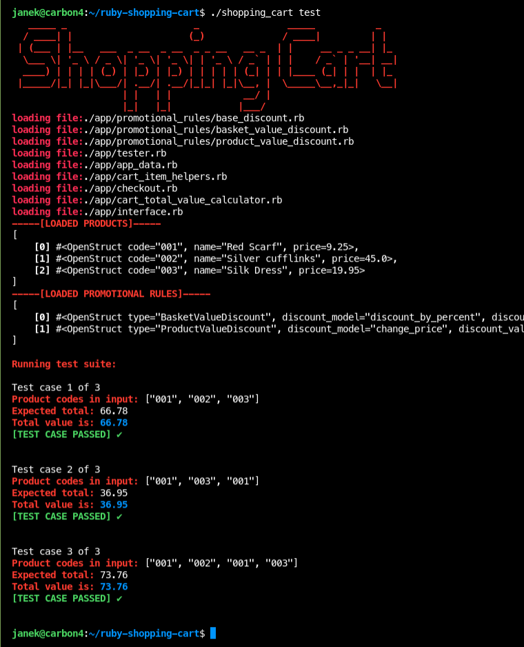
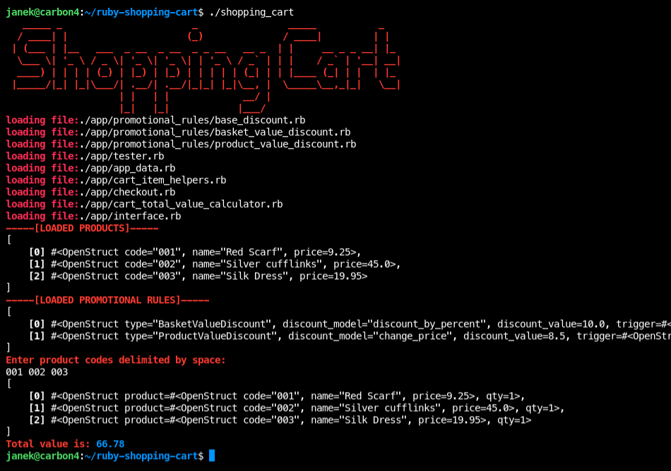

## What is it?

This is a recruitment task meeting requirements shown [here](https://github.com/chrisface/ruby_shopping_cart)

## How does it look like in action?

### Test suite


### in action


## Usage

prep work:
```bash
~ bundle install
~ chmod +x ./shopping_cart
```

### Running test suite

`~ ./shopping_cart test`

### Running in interface mode

`~ ./shopping_cart`

### Running in IRB mode

`~ ./shopping_cart irb`
